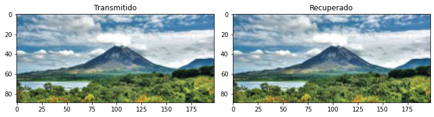
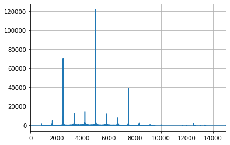

# Proyecto 4
En este proyecto se realizó una simulación de un sistema de comunicaciones utilizando una modulación 16-QAM.
Además se obtuvieron las pruebas de estacionariedad y ergocidad de la señal. Finalmente se obtuvo una gráfica con la densidad espectral de la potencia de la señal modulada.

**Modulación 16-QAM**:
Para crear la comunicación por medio de la modulación 16-QAM, primero se debe modular la información a transmitir construyendo las señales que portaran la imagen. Luego estas ondas deben pasar por un demodulador con la imposición de parámetros como la frecuencia, la cantidad de muestras y la relación de señal-ruido para al final obtener una imagen tranmistida recuperada con los datos enviados por la señal portadora. El resultado se puede apreciar en la siguiente figura:

**Estacionariedad y ergodicidad**:
Como estamos ante la presencia de un proceso estocástico podemos determinar la estacionariedad que describe las características estadísticas en el dominio del tiempo para ver si existe alguna varianza. Además, la ergodicidad que es el promedio estadístico cuando el proceso coincide con los términos temporales. Al tratarse de una imagen lo que se está transmitiendo, el elemento teórico esperado a ser transmitido es muy similar al que realmente llega al receptor.

**Densidad espectral de potencia**:
La siguiente imagen muestra la gráfica de la densidad espectral de potencia para la señal modulada, que tiene una acumulación de potencia al inicio.

